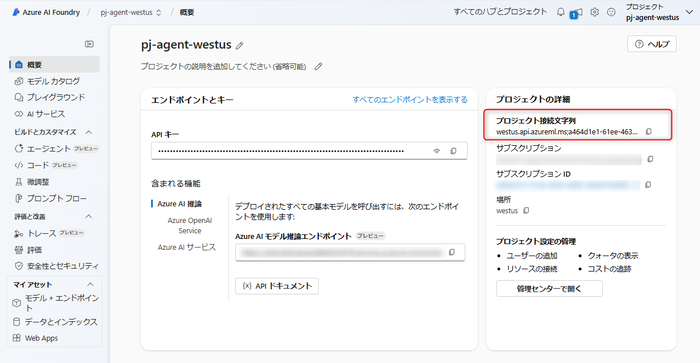

# Simple-Agent-Chat
Azure AI Agent を使ったシンプルなチャットUIを構築するコードです。

### python 仮想環境の構築と有効化
今回は python 3.12 で行いました。
``` sh
python -m pip install --upgrade pip
python -m venv .venv
./.venv/Scripts/activate
```

### 必要なライブラリのインストール
``` sh
pip install -r .\requirements.txt
```

### Azure AI Foundry でのモデルデプロイ
Azure Portal から Azure OpenAI リソースを作成後、Azure AI Foundry でプロジェクトを作成し、 gpt-4o-mini をデプロイしてください。


### 環境変数の設定
.env-sample のファイル名を .env に変更し、プロジェクトの接続文字列を設定



### 実行
``` sh
chainlit run app.py -w
```
localhost でブラウザにチャット画面が起動します。
